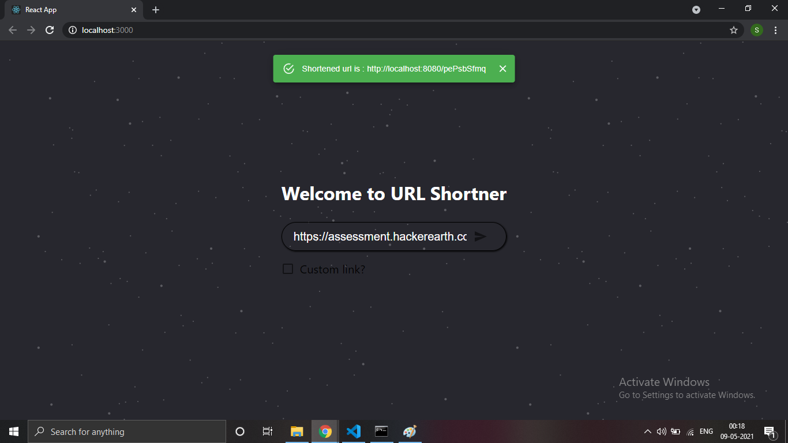

# URL Shortner Application
###### This is a web application developed using MERN stack. 

###### Dependency:
1. MongoDB
2. Node.js
3. npm 
###### Steps to use:
1. Start MongoDB server on localhost port 27017
2. Go to url-shortner-api directory in terminal
3. Run npm install
4. Run npm start
5. Now go to url-shortner-ui directory in terminal
6. Run npm install
7. Run npm start
8. Opne http://localhost:3000 in browser
9. Enter any valid url in the input box
10. Click on the button beside input box

11. For custom link, select checkbox
12. Enter any custom link
13. Click on the button beside input box

